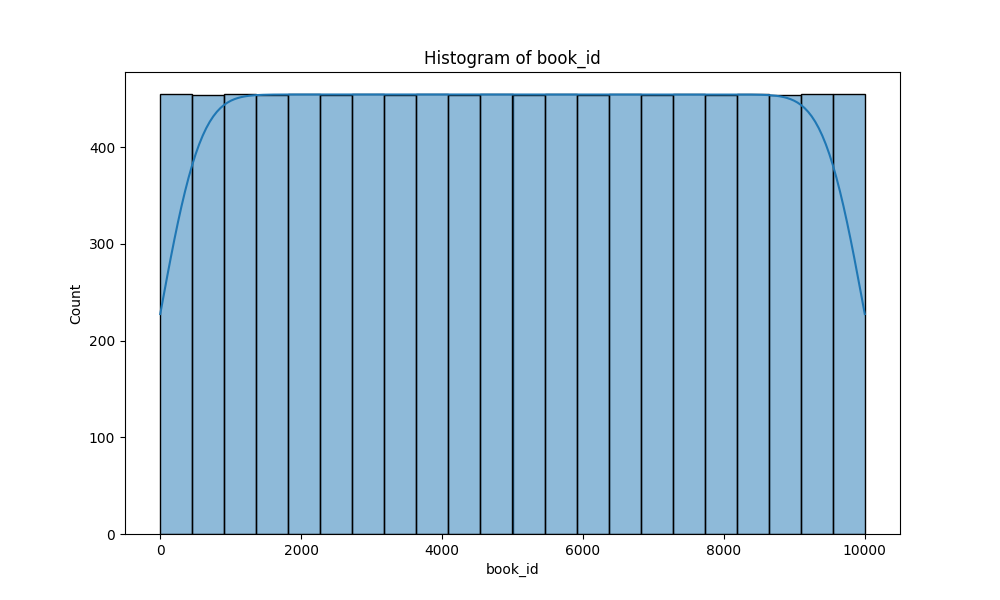
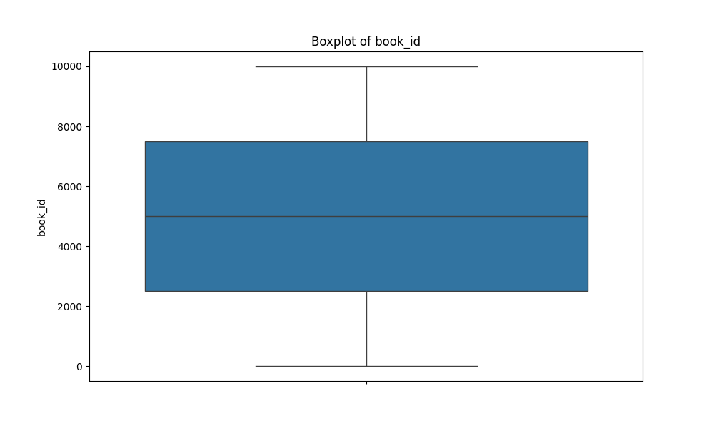

# Automated Dataset Analysis

## Summary
Columns: ['book_id', 'goodreads_book_id', 'best_book_id', 'work_id', 'books_count', 'isbn', 'isbn13', 'authors', 'original_publication_year', 'original_title', 'title', 'language_code', 'average_rating', 'ratings_count', 'work_ratings_count', 'work_text_reviews_count', 'ratings_1', 'ratings_2', 'ratings_3', 'ratings_4', 'ratings_5', 'image_url', 'small_image_url']
Missing Values: {'book_id': 0, 'goodreads_book_id': 0, 'best_book_id': 0, 'work_id': 0, 'books_count': 0, 'isbn': 700, 'isbn13': 585, 'authors': 0, 'original_publication_year': 21, 'original_title': 585, 'title': 0, 'language_code': 1084, 'average_rating': 0, 'ratings_count': 0, 'work_ratings_count': 0, 'work_text_reviews_count': 0, 'ratings_1': 0, 'ratings_2': 0, 'ratings_3': 0, 'ratings_4': 0, 'ratings_5': 0, 'image_url': 0, 'small_image_url': 0}
## Correlation Matrix

## Histograms

## Boxplots

## Insights
### 1. Key Findings and Insights from the Dataset

- **Overall Rating Trends**: The average rating across all books is approximately 4.00, indicating a generally positive reception. The ratings distribution shows that the majority of ratings are concentrated at the higher end, with a mean of 23,789.81 for 5-star ratings.
  
- **Authors and Books**: The dataset contains a total of 10,000 books with an average of 75.71 books per author (books_count). This suggests that some authors are quite prolific, contributing to a wide variety of titles.

- **Publication Year Insights**: The average original publication year is 1981, with a range that includes books published as early as -1750 (likely an error or misclassified entry) to 2017. This indicates a mix of both classic and contemporary literature.

- **Language Diversity**: There are a significant number of missing values in the `language_code` column (1,084 entries), which suggests potential bias toward English-language books unless further analyzed.

### 2. Patterns and Trends Observed in the Data

- **Ratings and Reviews Correlation**: There is a strong correlation between the number of ratings and the number of text reviews. The `ratings_count` shows a high correlation (0.995) with `work_ratings_count`, suggesting that books with more ratings tend to attract more reviews.

- **Impact of Ratings on Average Rating**: The distribution of ratings (1 to 5 stars) shows a strong inverse relationship with lower ratings. Books receiving high numbers of ratings (especially 1-star and 2-star) tend to have lower average ratings, while those with higher counts of 4 and 5-star ratings correlate with higher average ratings.

### 3. Potential Anomalies or Outliers and Their Implications

- **Outliers in Ratings**: The dataset shows substantial outliers in each ratings category. For example:
  - `ratings_5` shows a maximum of 3,011,543, which could skew the understanding of average ratings if not addressed.
  - `work_text_reviews_count` has a maximum of 155,254, which indicates that a few books are exceptionally popular or controversial.

- **Missing Values**: 
  - Significant missing values in `isbn`, `isbn13` (585 entries), and `language_code` (1,084 entries) may hinder deeper analyses regarding the publication details and language diversity.
  - The `original_title` also has 585 missing values; this could affect the title-based analysis or searches.

### 4. Suggestions for Further Analysis or Steps to Take Based on the Data

- **Data Cleaning**: Address missing values, particularly in critical fields like `isbn` and `language_code`. This could involve filling missing entries based on the most common languages or ISBNs.

- **Outlier Analysis**: Conduct a detailed analysis on outliers in ratings to understand whether they are genuine or erroneous entries. Box plots or other visualization techniques could help illustrate this.

- **Extended Analysis on Authors**: Investigate the distribution of books per author to identify prolific authors versus those with few books. This could provide insights into authorship trends.

- **Temporal Trends**: Analyze the trend of average ratings over time to determine if newer books are rated differently than older publications.

### 5. Additional Observations or Recommendations

- **Genre Analysis**: While not present in the dataset, incorporating genres could provide valuable insights into which types of books receive higher ratings or more reviews.

- **User Engagement**: Assess the relationship between work ratings and text reviews in more depth to gauge user engagement and sentiment.

- **Language-Specific Analysis**: If possible, conduct a comparative analysis of ratings and reviews across different languages to understand cultural preferences or biases.

- **Visualizations**: Employ visualizations such as histograms for rating distributions, bar charts for authorship analysis, and time series plots for publication year trends to enhance the insights derived from the data.

By following these recommendations, the analysis can be deepened, leading to more accurate insights and conclusions about the dataset and its implications for the book industry.