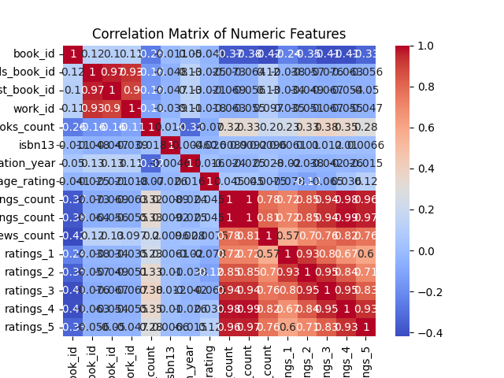

# Automated Dataset Analysis

## Summary
Columns: ['book_id', 'goodreads_book_id', 'best_book_id', 'work_id', 'books_count', 'isbn', 'isbn13', 'authors', 'original_publication_year', 'original_title', 'title', 'language_code', 'average_rating', 'ratings_count', 'work_ratings_count', 'work_text_reviews_count', 'ratings_1', 'ratings_2', 'ratings_3', 'ratings_4', 'ratings_5', 'image_url', 'small_image_url']
Missing Values: {'book_id': 0, 'goodreads_book_id': 0, 'best_book_id': 0, 'work_id': 0, 'books_count': 0, 'isbn': 700, 'isbn13': 585, 'authors': 0, 'original_publication_year': 21, 'original_title': 585, 'title': 0, 'language_code': 1084, 'average_rating': 0, 'ratings_count': 0, 'work_ratings_count': 0, 'work_text_reviews_count': 0, 'ratings_1': 0, 'ratings_2': 0, 'ratings_3': 0, 'ratings_4': 0, 'ratings_5': 0, 'image_url': 0, 'small_image_url': 0}
## Correlation Matrix

## Histograms

## Boxplots

## Insights
Certainly! Based on the dataset you provided, here's a comprehensive analysis:

### 1. Key Findings and Insights from the Dataset
- **Author Diversity**: The dataset includes a wide range of authors, with no missing data in the 'authors' column. This suggests a diverse collection of books.
- **Publication Trends**: Most books have been published within a relatively recent timeframe, with the mean original publication year around 1982. This indicates a focus on contemporary literature.
- **Average Ratings**: The average rating of the books is fairly high, averaging around 4.00, with a small standard deviation (0.25). This suggests that readers generally perceive the books positively.
- **Engagement Metrics**: The ratings count and work ratings count are notably high, indicating a significant level of engagement from readers.

### 2. Patterns and Trends Observed in the Data
- **Rating Distribution**: The ratings distribution shows a tendency towards higher ratings, particularly ratings of 4 and 5. This aligns with the high average rating noted earlier.
- **Language Variety**: The presence of missing values in the 'language_code' column (1,084 missing entries) suggests that some books may not have specified languages, which could limit the usability of the dataset for language-specific analysis.
- **Books Count**: The 'books_count' column exhibits a wide range, with some authors having published over 3,000 books. This indicates that prolific authors are represented in the dataset.

### 3. Potential Anomalies or Outliers and Their Implications
- **Outliers in Ratings**: The presence of outliers in the 'average_rating' column (with some books having an average rating significantly higher than the rest) could skew analysis if not handled appropriately. These outliers could indicate books that received exceptionally high praise or those with very few ratings.
- **Year of Publication Outliers**: The 'original_publication_year' shows some outliers dating back to -1750, which seems erroneous. This could potentially distort analyses regarding publication trends and should be examined further.
- **ISBN Missing Values**: A substantial number of missing values in the 'isbn' and 'isbn13' columns could hinder efforts to uniquely identify books and may affect merging with other datasets.

### 4. Suggestions for Further Analysis or Steps to Take Based on the Data
- **Analysis of Ratings and Reviews**: Conduct a deeper analysis of how the number of ratings correlates with average ratings. This could reveal if highly rated books generally have more reviews or if they are outliers.
- **Publication Year Analysis**: Further investigate the outliers in the 'original_publication_year' column. It would be beneficial to clean these entries or analyze them separately to understand their impact on the dataset.
- **Language Analysis**: Examine the missing values in the 'language_code' to assess if certain languages are underrepresented and whether this affects overall engagement metrics.
- **Author Analysis**: Consider analyzing the most prolific authors in the dataset to see if their volume of work correlates with average ratings or reader engagement.

### 5. Additional Observations or Recommendations
- **Visual Analysis**: Utilize visualizations (like histograms or boxplots) to better understand the distributions of various numeric columns, particularly for ratings and publication years.
- **Engagement Strategies**: Given the high average ratings, publishers and authors might focus on marketing books with high engagement metrics to boost visibility.
- **Data Enrichment**: Consider enriching the dataset with additional information such as genres or targeted demographics to enhance analysis capabilities.

Overall, this dataset provides a rich tapestry of information regarding the books, authors, and reader engagement on Goodreads. Further analysis could provide invaluable insights into literary trends and reader preferences.