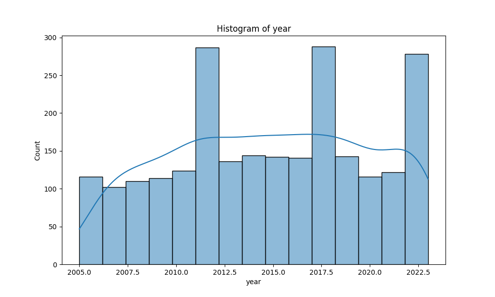
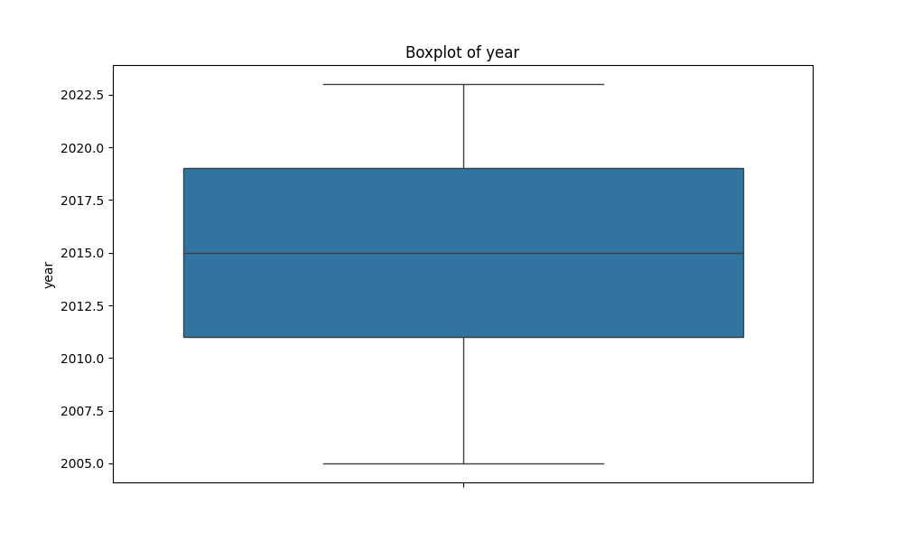

# Automated Dataset Analysis

## Summary
Columns: ['Country name', 'year', 'Life Ladder', 'Log GDP per capita', 'Social support', 'Healthy life expectancy at birth', 'Freedom to make life choices', 'Generosity', 'Perceptions of corruption', 'Positive affect', 'Negative affect']
Missing Values: {'Country name': 0, 'year': 0, 'Life Ladder': 0, 'Log GDP per capita': 28, 'Social support': 13, 'Healthy life expectancy at birth': 63, 'Freedom to make life choices': 36, 'Generosity': 81, 'Perceptions of corruption': 125, 'Positive affect': 24, 'Negative affect': 16}
## Correlation Matrix

## Histograms

## Boxplots

## Insights
### Key Findings and Insights from the Dataset

1. **Correlation**: The strongest correlations observed are between `Life Ladder` and:
   - `Log GDP per capita` (0.78)
   - `Social support` (0.72)
   - `Healthy life expectancy at birth` (0.71)
   - `Freedom to make life choices` (0.54)
   - Conversely, `Perceptions of corruption` has a significant negative correlation with `Life Ladder` (-0.43).

2. **Descriptive Statistics**:
   - The mean `Life Ladder` score is approximately 5.48, indicating a moderate level of life satisfaction among respondents.
   - The average `Log GDP per capita` is about 9.4, suggesting a reasonably high economic status in the dataset, but with some countries likely at lower income levels.
   - `Social support` and `Freedom to make life choices` also reflect positive societal trends, averaging around 0.81 and 0.75, respectively.

3. **Missing Values**: There are significant missing values in several columns, notably:
   - `Generosity` (81 missing values)
   - `Perceptions of corruption` (125 missing values)
   - This may affect the overall analysis and could potentially introduce bias if not handled appropriately.

### Patterns and Trends Observed in the Data

- **Temporal Trends**: The dataset spans from 2005 to 2023, with the mean year being around 2015. Analyzing changes over time could reveal how life satisfaction and economic indicators have evolved.
- **Geographical Patterns**: It would be beneficial to categorize countries by region to analyze regional trends in happiness, economic status, and social support. Countries in higher-income brackets generally show higher `Life Ladder` scores.

### Potential Anomalies or Outliers and Their Implications

- **Outliers**: 
   - `Life Ladder` has 2 outliers, and `Log GDP per capita` has 1. The presence of outliers in these critical metrics could skew mean values and correlations, suggesting that further investigation into these specific entries may be warranted.
   - `Perceptions of corruption` has a significant number of outliers (194), indicating that some countries perceive corruption levels very differently from others. This could suggest systemic issues in governance or public trust in institutions.

- **Implications**: The presence of outliers or anomalies may indicate unique circumstances in specific countries that could be investigated further. For instance, extremely low or high `Life Ladder` scores could be associated with socio-political factors or major events (e.g., economic crises, natural disasters).

### Suggestions for Further Analysis or Steps to Take Based on the Data

1. **Time-Series Analysis**: Conduct time-series analysis to observe trends in `Life Ladder`, `Log GDP per capita`, and other variables over the years. This could reveal how economic and social factors influence happiness over time.

2. **Regional Comparisons**: Expand the analysis to include a regional breakdown of the data to assess differences in quality of life indicators among various regions and their socio-economic contexts.

3. **Handle Missing Data**: Implement strategies for the missing data, such as imputation, to ensure that the dataset can be analyzed without significant gaps that could skew results.

4. **Investigate Outliers**: Conduct a deeper investigation into the outliers identified, particularly in variables related to `Life Ladder` and `Perceptions of corruption`, to understand the contextual factors influencing these values.

5. **Multivariate Analysis**: Explore relationships among multiple variables through multivariate regression analysis to assess how different factors collectively influence happiness and life satisfaction.

### Additional Observations or Recommendations

- **Data Quality**: Ensure that the quality of data is maintained and that discrepancies are addressed. This is crucial for accurate analysis and conclusions.
- **Consider External Factors**: Incorporate external factors such as political stability, healthcare quality, and educational access in future analyses to provide a more comprehensive view of the determinants of happiness.
- **Engage with Policy Makers**: The insights gained from the analysis can be valuable for policymakers focusing on improving societal well-being and addressing corruption.