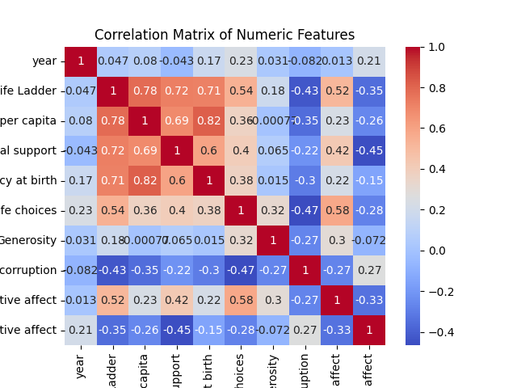

# Automated Dataset Analysis

## Summary
Columns: ['Country name', 'year', 'Life Ladder', 'Log GDP per capita', 'Social support', 'Healthy life expectancy at birth', 'Freedom to make life choices', 'Generosity', 'Perceptions of corruption', 'Positive affect', 'Negative affect']
Missing Values: {'Country name': 0, 'year': 0, 'Life Ladder': 0, 'Log GDP per capita': 28, 'Social support': 13, 'Healthy life expectancy at birth': 63, 'Freedom to make life choices': 36, 'Generosity': 81, 'Perceptions of corruption': 125, 'Positive affect': 24, 'Negative affect': 16}
## Correlation Matrix

## Histograms

## Boxplots

## Insights
### 1. Key Findings and Insights from the Dataset

- **Life Ladder**: The average score for the Life Ladder is 5.48, suggesting a moderate level of subjective well-being across the countries in the dataset. The scores range from 1.28 to 8.02, indicating significant variability in life satisfaction.
  
- **Economic Indicators**: The mean Log GDP per capita (9.40) suggests a diverse economic landscape, with a strong correlation (0.78) with the Life Ladder, indicating that wealthier countries tend to report higher life satisfaction.

- **Social Support**: The average score for social support is 0.81, with a strong positive correlation (0.72) with the Life Ladder, suggesting that countries with better social support systems tend to have happier populations.

- **Healthy Life Expectancy**: The average healthy life expectancy at birth is 63.4 years, with a correlation of 0.71 with the Life Ladder. This indicates that better health outcomes are linked with higher life satisfaction.

- **Freedom to Make Life Choices**: On average, this score is 0.75, with a significant positive correlation (0.54) with the Life Ladder, highlighting the importance of personal freedom in overall happiness.

- **Corruption Perception**: The mean perception of corruption score is 0.74, which negatively correlates with the Life Ladder (-0.43), suggesting that higher perceived corruption is associated with lower life satisfaction.

- **Positive and Negative Affect**: The average positive affect score is 0.65, while the average negative affect score is 0.27, indicating a generally positive emotional state among the populations surveyed. However, there is a negative correlation between positive and negative affects (-0.33), suggesting that as positive feelings increase, negative feelings tend to decrease.

### 2. Patterns and Trends Observed in the Data

- There is a clear trend where countries with higher GDP per capita also report better life satisfaction and healthy life expectancy.
  
- Social support appears to be a critical factor contributing to life satisfaction, emphasizing the need for strong community and familial networks.

- Freedom to make life choices has a notable impact on perceived happiness, underscoring the role of personal agency and autonomy in well-being.

- The data suggests that perceptions of corruption are detrimental to life satisfaction, indicating that transparency and governance are crucial for societal well-being.

### 3. Potential Anomalies or Outliers and Their Implications

- **Outliers in Life Ladder**: Two significant outliers could skew the overall understanding of life satisfaction in certain countries. Further investigation into these outliers could provide insights into unique socioeconomic or political factors affecting happiness.

- **Log GDP per capita**: One outlier might suggest an anomaly in reporting or economic conditions that warrant deeper exploration, especially if it significantly deviates from the overall trend.

- **Social Support**: A high number of outliers (48) indicates that some countries may have exceptionally low social support, which could correlate with lower life satisfaction in those regions.

- **Corruption Perception**: With 194 outliers, this suggests substantial variance in how corruption is perceived across countries, which could be linked to political stability, governance, and transparency issues.

### 4. Suggestions for Further Analysis or Steps to Take Based on the Data

- **Deeper Analysis of Outliers**: Conduct qualitative studies on countries with outliers in Life Ladder, GDP per capita, and social support to understand the underlying causes of these anomalies.

- **Longitudinal Study**: Analyze trends over time to observe how changes in economic factors, social support, and governance affect life satisfaction.

- **Regional Analysis**: Investigate differences in well-being across regions to identify specific cultural, economic, or social factors contributing to varying levels of life satisfaction.

- **Intervention Studies**: Explore the impact of specific policies (e.g., social programs, anti-corruption measures) on life satisfaction to identify effective practices.

### 5. Additional Observations or Recommendations

- **Integrate Qualitative Data**: Consider collecting qualitative data (e.g., interviews or surveys) to complement quantitative findings and provide a more nuanced understanding of happiness and well-being.

- **Policy Implications**: Policymakers should focus on enhancing social support systems, reducing corruption, and promoting economic growth to improve life satisfaction.

- **Focus on Mental Health**: Given the relationship between positive and negative affects, mental health initiatives that promote positive emotions could be beneficial.

- **Data Quality Improvement**: Address missing values and outliers in future datasets to improve the robustness of analyses and insights derived from the data.

### Conclusion

This dataset provides valuable insights into the factors influencing life satisfaction across countries. By focusing on economic indicators, social support, freedom, and corruption perceptions, stakeholders can better understand and address the determinants of well-being in different populations. Further analyses and targeted interventions could help enhance the quality of life globally.