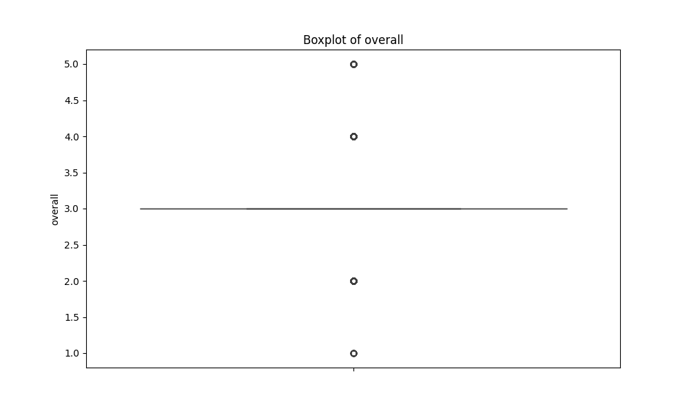

# Automated Dataset Analysis

## Summary
Columns: ['date', 'language', 'type', 'title', 'by', 'overall', 'quality', 'repeatability']
Missing Values: {'date': 99, 'language': 0, 'type': 0, 'title': 0, 'by': 262, 'overall': 0, 'quality': 0, 'repeatability': 0}
## Correlation Matrix

## Histograms

## Boxplots

## Insights
Based on the provided dataset and the accompanying analyses, here are the key findings, insights, and recommendations:

### 1. Key Findings and Insights from the Dataset
- **Data Composition**: The dataset contains 2652 entries with multiple attributes related to ratings (overall, quality, and repeatability) across different languages and types. However, there are 99 missing values in the 'date' column and 262 missing values in the 'by' column, which may affect any time-series analysis or assessments of ratings by contributors.
  
- **Numerical Summary**: The mean ratings for 'overall' and 'quality' are relatively close (3.05 and 3.21, respectively), suggesting that most ratings tend to cluster around the middle of the scale, indicating general satisfaction but with significant room for improvement. The 'repeatability' rating tends to be lower, with a mean of 1.49, suggesting that repeatability is perceived poorly.

### 2. Patterns and Trends Observed in the Data
- **Rating Distributions**: The quartiles for both 'overall' and 'quality' ratings indicate that a significant portion of the ratings falls below 4.0 (75% quartile), revealing that while there are some high ratings (up to 5), the majority are in the lower to mid-range. This is a sign of potential dissatisfaction or inconsistency in experiences.

- **Correlation Insights**: There is a strong positive correlation (0.826) between 'overall' and 'quality', indicating that as the quality rating increases, so does the overall rating. The correlation between 'overall' and 'repeatability' (0.513) is moderate, suggesting that repeatability influences overall satisfaction but is not as strong a factor as quality.

### 3. Potential Anomalies or Outliers and Their Implications
- **Outliers in Ratings**: There are 1216 outliers in 'overall' ratings, which may represent extreme satisfaction or dissatisfaction. Such a high number of outliers can skew insights and should be examined further to understand the reasons behind these ratings.

- **Quality Outliers**: Only 24 outliers were identified in the 'quality' ratings. This suggests a more consistent perception of quality, indicating that extreme opinions may be more prevalent in overall satisfaction than in quality assessments.

- **Repeatability**: The absence of outliers in repeatability ratings might indicate that this aspect is uniformly rated, although it is rated low on average, which might require investigation into why repeatability is perceived poorly.

### 4. Suggestions for Further Analysis or Steps to Take
- **Handling Missing Values**: Address the missing values in 'date' and 'by' columns through imputation or exclusion, depending on the analysis goals. This may involve using statistical methods or simply removing entries with high amounts of missing data.

- **Investigate Outliers**: Perform deeper qualitative analysis on the 1216 outliers in 'overall' ratings to understand the factors leading to extreme scores. This could involve reviewing comments or feedback associated with those ratings.

- **Segment Analysis**: Consider segmenting the data by 'language' and 'type' to identify patterns specific to certain demographics or categories. Analyzing subsets may reveal varied experiences that could inform targeted improvements.

- **Time Series Analysis**: If the missing values in the 'date' column can be addressed, time series analysis could be performed to detect trends over time.

### 5. Additional Observations or Recommendations
- **Focus on Improvement Areas**: With the 'repeatability' ratings being low, it may be worthwhile to investigate the processes or products involved in these ratings to identify factors leading to such perceptions.

- **Customer Feedback Loop**: Establish mechanisms to solicit and analyze qualitative feedback from users to complement the quantitative ratings. This can provide context for the numbers and guide improvements.

- **Ongoing Monitoring**: Implement a system for ongoing data collection and analysis to track changes in ratings over time, especially after implementing changes based on user feedback.

By following these insights and recommendations, the organization can better understand user perceptions, improve offerings, and enhance overall satisfaction.