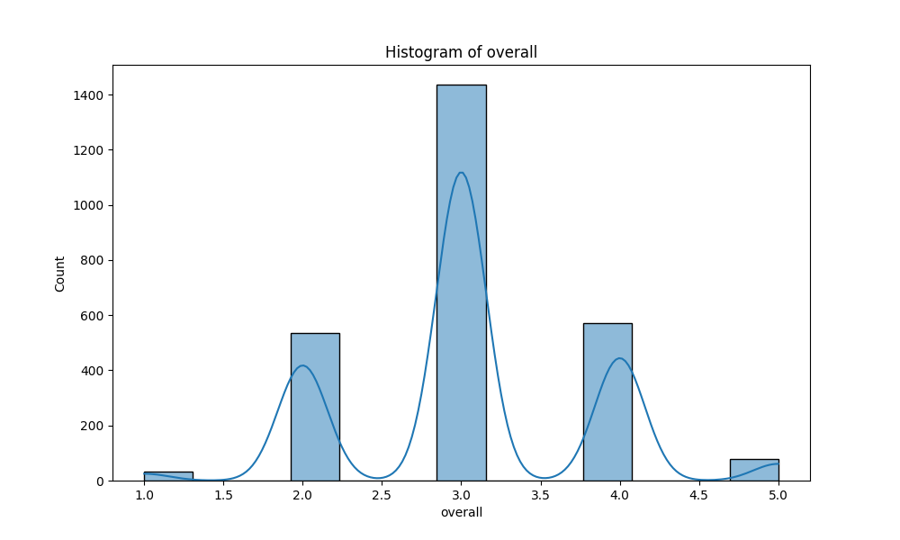

# Automated Dataset Analysis

## Summary
Columns: ['date', 'language', 'type', 'title', 'by', 'overall', 'quality', 'repeatability']
Missing Values: {'date': 99, 'language': 0, 'type': 0, 'title': 0, 'by': 262, 'overall': 0, 'quality': 0, 'repeatability': 0}
## Correlation Matrix

## Histograms

## Boxplots

## Insights
Based on the provided dataset and the accompanying details, here are the insights and analyses:

### 1. Key Findings and Insights from the Dataset
- **Overall Ratings**: The mean overall rating is approximately 3.05, with a relatively low standard deviation (0.76), indicating that most ratings are clustered around the average with few outliers. The ratings range from 1 to 5, with a notable number (25%) of scores being 3.
- **Quality Ratings**: The average quality rating is slightly higher at approximately 3.21 with a standard deviation of around 0.80. The majority of ratings also center around the middle of the scale.
- **Repeatability**: The average repeatability score is quite low at about 1.49, suggesting that repeat viewing is not common among the media reviewed.
- **Missing Values**: The 'date' and 'by' columns contain missing values. The 'date' column has 99 missing entries, which may affect time-related analyses.

### 2. Patterns and Trends Observed in the Data
- **Language and Type**: The dataset appears to focus on Tamil and Telugu movies, predominantly. Analyzing the number of entries by language could indicate which language is more dominant in the dataset.
- **Correlation**: A strong positive correlation exists between overall and quality ratings (0.83), indicating that higher quality ratings typically result in higher overall ratings. There is a moderate correlation between overall ratings and repeatability (0.51).
- **Temporal Analysis**: If the missing values in the 'date' column could be addressed, a temporal analysis could reveal trends over time (e.g., whether ratings are improving).

### 3. Potential Anomalies or Outliers and Their Implications
- **Outliers in Ratings**: Given the ratings scale of 1 to 5, any ratings of 1 or 5 could be considered outliers, especially if they are few. For instance, if a particular media title has a rating of 1 while others are around 3, it might suggest a serious issue with that title (e.g., poor production quality or negative reception).
- **Missing 'by' Values**: The missing data in the 'by' column (262 entries) could imply a lack of information about the creators or actors involved, which is critical for analyzing trends related to production quality or popularity.

### 4. Suggestions for Further Analysis or Steps to Take Based on the Data
- **Impute Missing Values**: For the 'date' and 'by' columns, consider imputing missing values if possible, or analyze the impact of these missing values on overall analyses.
- **Categorical Analysis**: Perform a breakdown of ratings by 'language' and 'type' to see if certain categories consistently receive higher or lower ratings.
- **Temporal Trends**: Once the date issue is resolved, analyze trends in ratings over time. This could help identify whether certain periods yield better media quality or reception.
- **Deeper Correlation Studies**: Explore the correlation between 'type' (e.g., movie, series) and overall ratings to see if certain formats are rated more favorably.

### 5. Additional Observations or Recommendations
- **Quality Control**: Given the apparent low repeatability score, it may be worthwhile to investigate why viewers are not inclined to rewatch certain titles. This could lead to insights about audience preferences.
- **User Feedback**: If additional qualitative data (e.g., user reviews or comments) could be incorporated, it would enrich the analysis by providing context behind the ratings.
- **Visualizations**: Utilize more visualizations such as box plots and scatter plots to better illustrate the relationships between different variables in the dataset. This could assist in identifying patterns that may not be immediately obvious from summary statistics alone.

In summary, while the dataset provides a solid foundation for analyzing media ratings, addressing missing values and expanding the analysis to include categorical breakdowns and temporal trends would enhance the understanding of audience preferences and media performance.